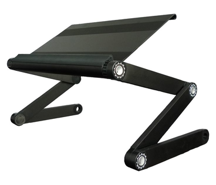

# Charo Nuguid

##  About

I'm Charo Nuguid, and I'm an independent Technology Consultant and Trainer.

I have a blog called [The Geekette Speaketh](http://thegeekettespeaketh.com).

I'm also on <a rel="me" href="https://hachyderm.io/@headgeekette">Mastadon</a>.

## Hardware

I use two laptops named Elli and Minerva.

Elli is an old 2011 NEO B5700 laptop that stays at home and acts as my _desktop_. She has an Intel i7 (Sandy Bridge) processor with 4GB RAM. Incidentally, she's built out of a Clevo computer. I plan to upgrade her memory and buy her a new battery soon. I use a standing desk setup making use of laptop risers similar to the one below:

Minerva is a Dell XPS 13 (9370). It has an 8th generation i7 processor with 16 GB RAM and a 512 GB SSD. I bring her everywhere.

I also have another mobile setup using a Raspberry Pi 3 B+ and a 7-inch LCD capacitive touchscreen. This setup is powered by a 20,000 mAh powerbank. I use it for IoT demonstrations. I would use my Huawei P20 phone as a hotspot between the RasPi and Minerva.

When my laptop can't handle the building of some of my docker containers, I ssh into an AWS EC2 instance.

I also have a 1 TB external desktop drive.

## Software

* Visual Studio Code for all my coding needs
* Sublime Text and vim for text editing
* Git for version control
* Github for open source projects
* Bitbucket for open source and private projects, as well as personal journal and to-do list
* Chrome for work
* Firefox for work and leisure
* Google Drive and AWS S3 for cloud storage
* AWS S3 for my blog
* LastPass
* Gmail
* Diigo and Pocket for bookmarking
* Namecheap
* Steam for gaming

## Dream Setup

My dream setup changes every year. For now, I'd like to create a mini computer lab out of a cluster of Raspberry Pi 4 units.

## Others

n/a
